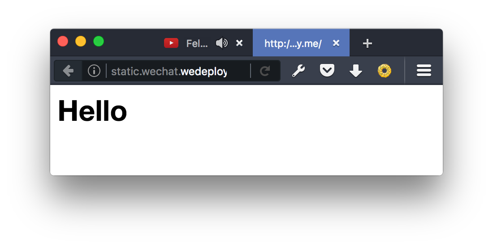
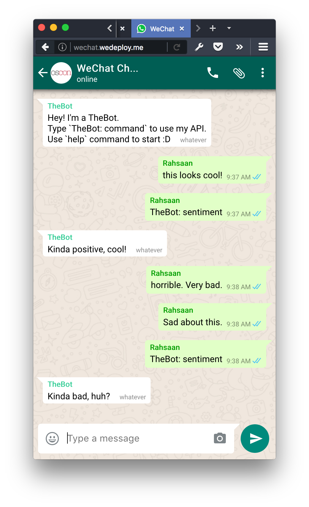

# WeChat


Assuming you've already installed the [WeDeploy CLI](https://github.com/wedeploy/cli) and have Docker ready, this sample guides you through the usage of some of the available containers.


## tl;dr

0. `we run`
1. `git clone git@github.com:cirocosta/sample-wechat.git`
2. `we link`
3. `open http://wechat.wedeploy.me`


|   name      |     type            |    description                                                  | 
|   :---:     |     :---:           |     :----                                                       | 
| static      | wedeploy/hosting    | Hosts frontend static code                                      |  
| data        | wedeploy/data       | Holds messages data                                             | 
| bot         | wedeploy/maven      | Listens to messages and executes bot commands                   | 
| sentimenter | wedeploy/nodejs     | Exposes /analyzeAll endpoint to perform sentiment analysis      | 
| auth        | wedeploy/auth       | Provides authentication                                         |
| favorites   | wedeploy/maven      | Holds favorite messages performing some validation w/ handlers  |


## Configuring the Environment

WeDeploy relies on just two dependencies:

1. Docker

If you're a MacOSX user head to [https://docs.docker.com/docker-for-mac/](Docker for Mac) and just install it like you'd do for any other app.  If you're on Linux you're just a few `package-manager-of-your-distro` steps away. Follow the [Docker Documentation for Ubuntu Linux](https://docs.docker.com/engine/installation/linux/ubuntulinux/) (for docs regarding other distros check the sidebar on the left).


2. WeDeploy CLI (`we`)

The CLI comprehends of a single binary that must be located on your `$PATH`. Go to [the stable channel download page](https://dl.equinox.io/wedeploy/cli/stable) and follow the instructions. After the fact you'll have the `we` command.

You can verify that `we` is working by outputing the version:

  ```sh
  we version
# WeDeploy CLI version 1.0.0-alpha-22 darwin/amd64
# build 78ae3b6cb6c73171cc021c0f9f6569b863f251d2
  ```

At any moment, use `we help` to gather information about the available commands. Any command can have it's help output by appending `--help` to the command, like:


  ```sh
  we version --help
  ```


## Getting Started

Launch the local development infrastructure with `we run`. It's expected that in approximately 25s the infrastructure will be all up and ready to go:

  ```sh
  we run

# ○ Starting WeDeploy.. 21s
# You can now test your apps locally. Press Ctrl+C to shut it down when you are done.
  ```

As in all local development containers are reachable through their URLs having `.me` top level domain, you can check whether that there's really a server sitting on `wedeploy.me`:


  ```sh
   curl -s -D - wechat.wedeploy.me -o /dev/null

# HTTP/1.0 503 Service Unavailable
# Cache-Control: no-cache
# Connection: close
# Content-Type: text/html
  ```

As expected, 503 is returned as no project with a container is available for such domain. You're ready to go!


### Configuring the project

The first step performed to configure the project was the `we create`. It's purpose is to create new projects and containers. We do so by first creating a directory with a `project.json`:


  ```sh
  we create

# Creating project:
# ID: wechat
# Name: WeChat        
# Custom domain: 
# Project created at /tmp/techtalk/wechat

  tree

# .
# └── wechat
#     └── project.json

# 1 directory, 1 file

  cat wechat/project.json

# {
#   "id": "wechat",
#   "name": "WeChat"
# }
  ```

Having that set up, from the `wechat` directory we start creating our containers.


### A hosting container configuration


From `wechat` directory, use `we create <container_id>` to create a container with a particular container id. This `id` is the one that will be used in the `url` used to access it (`<container_id>.<project_id>.wedeploy.me` locally; `<container_id>.<project_id>.wedeploy.io` on the could).


  ```sh
  wechat $ ls
  project.json

  wechat $  we create static

# 5) WeDeploy Hosting                        wedeploy/hosting:latest
# Easily deploy and host your app's static assets (HTML, CSS, JavaScript, etc)
# with our production-grade hosting service.

# Select container type from 1..7: 5
# Id [default: wedeploy-hosting]: static
# Name [default: WeDeploy Hosting]: Static Assets
# Container created at /tmp/techtalk/wechat/static

 wechat $  tree

# .
# ├── project.json
# └── static
#     └── container.json

# 1 directory, 2 files

  cat static/container.json

# {
#     "id": "static",
#     "name": "Frontend",
#     "type": "wedeploy/hosting"
# }
  ```

Now you've got all the configuration required for running an instance of a container in a project. 

The `hosting` container type just needs some static files on its root to start serving it. We can do so by populating it with an `index.html`:


  ```sh
  echo "<h1>Hello!</h1>" > static/index.html
  ```


### Running the project's containers locally

Having a project defined and a set of containers to run, you're ready to run instances of these containers. Head to the project's root (where the `project.json` lives) and ùse the `link` command:

  ```sh
  pwd
#  /tmp/techtalk/wechat

 tree
# .
# ├── project.json
# └── static
#     ├── container.json
#     └── index.html

  we link

# New project wechat created.
# Project WeChat wechat.wedeploy.me                                UP 
# ● Static Assets       static.wechat.wedeploy.me         wedeploy/hosting    up

  open http://static.wechat.wedeploy.me
  ```


 

Having presented the most basic flow, now you can go ahead with the WeChat sample :smiley:


### Running the sample

Just go to `wechat` root (where `project.json` lives) and run `we link`. You might notice that in the `project.json` there's a `homeContainer` field. This indicates  which of the containers of the project is the responsible for responding to requests to `<project_id>.wedeploy.me`. In our case, the container with the id `static` is the one that does it.

  ```sh
  cat wechat/project.json

# {
#   "id": "wechat",
#   "name": "WeChat",
#   "homeContainer": "static"
# }

  we link

# Project WeChat wechat.wedeploy.me                                  UP   
# ● Pedantic            auth.wechat.wedeploy.me           wedeploy/auth       up
# ● Awesome             bot.wechat.wedeploy.me            wedeploy/maven      up
# ● Cranky              data.wechat.wedeploy.me           wedeploy/data       up
# ● Big                 favorites.wechat.wedeploy.me      wedeploy/maven      up
# ● Sentimenter         sentimenter.wechat.wedeploy.me    wedeploy/nodejs     up
# ● Frontend            static.wechat.wedeploy.me         wedeploy/hosting    up
  ```

Now head to `static.wechat.wedeploy.me` or simply `wechat.wedeploy.me`:


  ```sh
  open http://wechat.wedeploy.me
  ```





At any time you can remove the project by `we unlink`ing from the project root. As these commands are aware of the project's context you can also execute them from within a container directory. For instance, using the `we restart` command:

  ```sh
  cd wechat/static
  we restart      # restarts only the static container

# first:
# ● Frontend            static.wechat.wedeploy.me         wedeploy/hosting    up

# then:
# ● Frontend            static.wechat.wedeploy.me         wedeploy/hosting    down

# and  then:
# ● Frontend            static.wechat.wedeploy.me         wedeploy/hosting    up


  cd wechat
  we restart      # restarts all of the project's containers

# ● Pedantic            auth.wechat.wedeploy.me           wedeploy/auth       up
# ● Awesome             bot.wechat.wedeploy.me            wedeploy/maven      up
# ● Cranky              data.wechat.wedeploy.me           wedeploy/data       up
# ● Big                 favorites.wechat.wedeploy.me      wedeploy/maven      up
# ● Sentimenter         sentimenter.wechat.wedeploy.me    wedeploy/nodejs     up
# ● Frontend            static.wechat.wedeploy.me         wedeploy/hosting    up
  ```


### The End

That's it! If you have any questions or find any bugs, just open an issue. We're **really** looking for feedback. Really. ANY questions!

Don't forget to check out the WeDeploy Documentation Center! [wedeploy.com/docs](http://wedeploy.com/ocs) .


